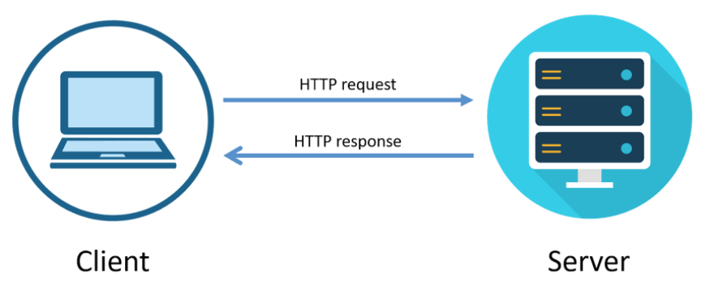
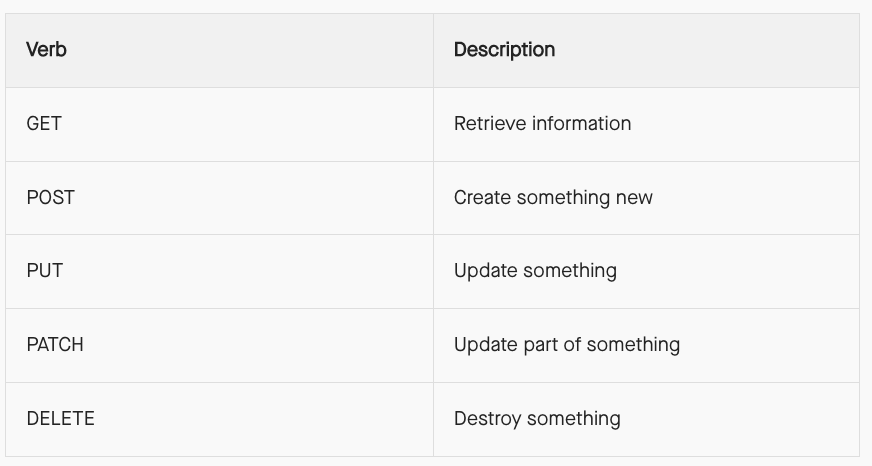
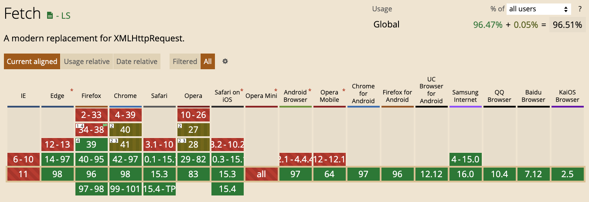

# Week 5

## jQuery

<a href="https://jquery.com/">jQuery</a> is a JavaScript file that you include in your web pages. It lets you find elements using CSS-style selectors and then do something with the elements using jQuery methods.

```
<script src="https://code.jquery.com/jquery-3.6.0.min.js"></script>
```

### jQuery Object

jQuery comes with it’s own object, the dollar sign, $, also known as jQuery. The $ object is specifically made for selecting an element and then returning that element node to perform an action on it.

```
$();
jQuery();
```

### Selectors

One of the core concepts of jQuery is to select elements and perform an action.

The jQuery() function has one parameter: a CSS-style selector. This selector finds any element or CSS selector:

```
$('.feature');           // Class selector
$('li strong');          // Descendant selector
$('em, i');              // Multiple selector
$('a[target="_blank"]'); // Attribute selector
$('#product)');          // ID selector
```

#### This Selection Keyword

When working inside of a jQuery function you may want to select the element in which was referenced inside of the original selector. In this event the this keyword may be used to refer to the element selected in the current handler.

```
$('div').click(function(event){ 
  $(this);
});
```

#### jQuery Selection Filters

Should CSS selectors not be enough there are also <a href="https://api.jquery.com/category/selectors/jquery-selector-extensions/">custom filters</a> built into jQuery to help out. These filters are an extension to CSS3 and provide more control over selecting an element or its relatives.

```
$('div:has(strong)');
```

### Traversing 

The general CSS selectors may not be enough and a little more detailed control is desired. jQuery provides a handful of methods for traversing up and down the DOM tree, filtering and selecting elements as necessary.

In the example below the original selection finds all of the div elements in the DOM, which are then filtered using the .not() method. With this specific method all of the div elements without a class of type or collection will be selected.

```
$('div').not('.type, .collection');
```

#### Chaining

Different traversing methods may be chained together simply by using a dot in-between them.

The code sample below uses both the .not() method and the .parent() method. Combined together this will only select the parent elements of div elements without a class of type or collection.

```
$('div').not('.type, .collection').parent();
```

#### Traversing Methods

 These methods fall into three categories, filtering, miscellaneous traversing, and DOM tree traversing. 

 Filtering:
 - [.eq()](https://api.jquery.com/eq/#eq-index)
 - [.has()](https://api.jquery.com/has/#has-selector)
 - [.map()](https://api.jquery.com/map/#map-callback)
 - [.filter()](https://api.jquery.com/filter/#filter-selector)
 - [.is()](https://api.jquery.com/is/#is-selector)
 - [.first()](https://api.jquery.com/first/#first)
 - [.last()](https://api.jquery.com/last/#last)

 DOM Tree Traversal
  - [.children()](https://api.jquery.com/children/#children-selector)
  - [.closest()](https://api.jquery.com/closest/#closest-selector)
  - [.find()](https://api.jquery.com/find/#find-selector)
  - [.next()](https://api.jquery.com/next/#next-selector)
  - [.parent()](https://api.jquery.com/parent/#parent-selector)
  - [.prev()](https://api.jquery.com/prev/#prev-selector)

### Manipulation

Once elements are fouind via the selecting and/or traversing methods, what do we do with them?

Elements may be altered in the DOM, changing their placement, removing them, adding new elements, and so forth. Overall the options to manipulate elements are fairly vast.

### Getting and Setting

 Getting information revolves around using a selector in addition with a method to determine what piece of information is to be retrieved.

 ```
 // Gets the value of the alt attribute
$('img').attr('alt');

// Sets the value of the alt attribute
$('img').attr('alt', 'Wild kangaroo');
 ```

#### Attribute Manipulation

One part of elements able to be inspected and manipulated are attributes. A few options include the ability to add, remove, or change an attribute or its value. 

In the examples below the .addClass() method is used to add a class to all even list items, the .removeClass() method is used to remove all classes from any paragraphs, and lastly the .attr() method is used to find the value of the title attribute of any abbr element and set it to Hello World.

```
$('li:even').addClass('even-item');
$('p').removeClass();
$('abbr').attr('title', 'Hello World');
```

Some of the attribute methods:

- [.addClass()](https://api.jquery.com/addClass/#addClass-className)
- [.attr()](https://api.jquery.com/attr/#attr-attributeName)
- [.hasClass()](https://api.jquery.com/hasClass/#hasClass-className)
- [.removeAttr()](https://api.jquery.com/removeAttr/#removeAttr-attributeName)
- [.removeClass()](https://api.jquery.com/removeClass/#removeClass-className)
- [.toggleClass()](https://api.jquery.com/toggleClass/#toggleClass-className)
- [.val()](https://api.jquery.com/val/#val)

#### Style Manipulation

On top of manipulating attributes, the style of an element may also be manipulated using a variety of methods. When reading or setting the height, width, or position of an element there are a handful of special methods available, and for all other style manipulations the .css() method can handle any CSS alterations.

The .css() method may be used to set one property, or many, and the syntax for each varies. To set one property, the property name and value should each be in quotations and comma separated. To set multiple properties, the properties should be nested inside of curly brackets with the property name in camel case, removing any hyphens where necessary, followed by a colon and then the quoted value. Each of the property and value pairs need to be comma separated.

```
$('h1 span').css('font-size', 'normal');
$('div').css({
  fontSize: '13px', 
  background: '#f60'
});
$('header').height(200);
```

Some of the style methods:

- [.css()](https://api.jquery.com/css/)
- [.height()](https://api.jquery.com/height/#height)
- [.position()](https://api.jquery.com/position/#position)
- [.width()](https://api.jquery.com/width/#width)

#### DOM Manipultion

We can inspect and manipulate the DOM, changing the placement of elements, adding and removing elements, as well as flat out altering elements. The options here are deep and varied, allowing for any potential changes to be made inside the DOM.

Each individual DOM manipulation method has it’s own syntax but a few of them are outlined below.

```
$('section').prepend('<h3>Featured</h3>');
$('a[target="_blank"]').after('<em>New window.</em>');
$('h1').text('Hello World');
```

Some of the DOM methods:

- [.after()](https://api.jquery.com/after/#after-content-content)
- [.append()](https://api.jquery.com/append/#append-content-content)
- [.prepend()](https://api.jquery.com/prepend/#prepend-content-content)
- [.empty()](https://api.jquery.com/empty/#empty)
- [.html()](https://api.jquery.com/html/#html)
- [.text()](https://api.jquery.com/text/#text)

### Events

jQuery can easily handle event handlers, which are methods that are called only upon a specific event or action taking place. For example, the method of adding a class to an element can be set to only occur upon that element being clicked on.

```
$('li').click(function(event){
  $(this).addClass('saved-item');
});
```

The .click() event method, along with a handful of other event methods, is actually a shorthand method which uses the .on() method introduced. The .on() method uses automatic delegation for elements that get added to the page dynamically.

Making use of the .on() method the first argument should be the native event name while the second argument should be the event handler function. 


```
$('li').on('click', function(event){
  $(this).addClass('saved-item');
});
```

### Additional Resources

 - [W3Schools Tutoials](https://www.w3schools.com/jquery/default.asp)
 - [jQuery CheatSheet](https://htmlcheatsheet.com/jquery/)
 - [Traversy Media Playlist](https://www.youtube.com/playlist?list=PLillGF-RfqbYJVXBgZ_nA7FTAAEpp_IAc)
 - [Net Ninja Playlist](https://www.youtube.com/watch?v=jVe1GBCqFIE&list=PL4cUxeGkcC9hNUJ0j6ccnOAcJIPoTRpO4)
  - [Freecodecamp's Beau Playlist](https://www.youtube.com/playlist?list=PLWKjhJtqVAbkyK9woUZUtunToLtNGoQHB)


## Architecture of web apps: Clients and Servers

When you open a web page (e.g. web app),it opens with text, a background, and a set of images. You click a button, and the page changes. The original text is replaced, new images are displayed, a modal pops up. Your browser is referred to in web development as the client (or “frontend”) – a web-accessing device or software.

Servers expose resources to clients. Those resources could be HTML, CSS, JavaScript, image, video, or audio files, or data, to name but a few. Sometimes those resources are stored on the server itself; other times, the server might provide a path from a database hosted on a different server to the requesting client. The key thing to remember is that servers make it possible for clients to get the files, data, and other resources they need in order to do something valuable for an end user.

Browsers aren’t the only type of client, however.  There are command line clients like curl, special purpose clients like Postman, and apps on your smartphone that request data from web servers. The important thing to remember is that a client requests resources and a server exposes resources.

### Request-Response Cycle

When to request a url from a web address, lots of things happen behind the scenes in
a certain order:

1. The browser parses the URL
2. The browser sends the domain name to the ISP
3. The ISP looks up the IP address in the DNS
4. The ISP sends the IP address back to the browser
5. The browser opens a connection to the server located at the IP address
6. The browser sends a request to the server
7. The server sends a response
8. Repeat steps 6 and 7 until the browser has all of the resources it needs





## Concurrent Tasks in JavaScript (faking concurrency with asynchronous)

A program is “concurrent” when it manages multiple activities with overlapping timelines. Concurrent programs in Java or C++ use multiple threads of execution. When a processor has more than one core, these threads truly run in parallel. But there is a problem programmers must be careful to protect data, so that there is no corruption when a value is updated by different threads at the same time.

In contrast, a JavaScript program runs in a <strong>single</strong> thread. 

In particular, once a function starts, it will run to completion before any other part of your program starts running. That is good. You know that no other code will corrupt the data that your function uses. No other code will try to read any of the data until after the function returns. Inside your function, you can modify the program’s variables to your heart’s content, as long as you clean up before the function returns. You never have to worry about mut or deadlocks.

The problem with having a single thread is obvious: If a program needs to wait for something to happen—most commonly, for data across the Internet—it cannot do anything else. Therefore, time-consuming operations in JavaScript are always asynchronous.

You specify what you want, and provide <strong>callback functions</strong> that are invoked when data is available or when an error has occurred. The current function continues execution so that other work can be done.

## AJAX

Let's take a step into a time machine. The year is 2005. 🕔🚀🕤

Wouldn't it be nice if page refreshes didn't exist? What if we could do
multiple things at once from a single web page? 

In a perfect world we could type into a search textbox and have searches performed in the background as we type. That world is here, and it's called Ajax! <a href="https://developer.mozilla.org/en-US/docs/Web/Guide/AJAX">Asynchronous JavaScript and XML (Ajax)<a/> is a technique that is used in web applications. It provides a way to retrieve content from a server and display it without having to refresh the entire page.

In the background, requests are made to a web API using JavaScript. As developers we can then choose to alter the displayed HTML based on the responses from the web API. 

And the new era in the web was born called <a href="https://en.wikipedia.org/wiki/Web_2.0">Web 2.0</a>. 

Typically, AJAX requests are made to web-based APIs, or application programming interfaces. In general, an API is a specification allowing two systems to communicate. 

For instance, the jQuery library provides an API for DOM manipulation and traversal. A web-based API, then, is one that allows clients to get data from servers on the web. Many companies provide public web APIs that you can build on top of; for example, you can access census data via an API provided by the government, New York Times articles via their API, or you can include messaging and voice calling in an application using the Twilio API.

### Twitter Infinite Scroll 

After you log in, Twitter sends back an HTML file that contains an initial batch of tweets, along with references to other resources the page requires (CSS, JavaScript, and image files). By the time you're scrolling through the timeline, typically the page will have fully loaded, and the JavaScript application layer will be running. That application can detect when you're nearing the bottom of the timeline, and when it sees this happen, it makes a request to the Twitter API for more tweets to display. 

The server responds with JSON data representing additional tweets. The application then inserts the data from these tweets at the bottom of the page, typically before you've reached the bottom. From the standpoint of the end user, there's an unending stream of tweets to read as they scroll down. But behind the scenes, the app is making an asynchronous request for more data and inserting that data into the DOM as it becomes available.

### Anatomy of Request and Response Messages

In the client-server model, web clients make requests to servers, which send back responses, which the client then consumes. These requests and responses are also referred to as HTTP messages. HTTP being a set of rules governing how clients and servers interact.

These rules require request and response messages to be structured in a specific way:


HTTP messages are broken up into 4 parts:

1. start-line: a high-level description of the message
2. HTTP headers: details describing the message
3. empty line: space to separate the meta-data from the body of the message
4. body: the data included in the message

### Request Messages

GET tells the server what the request is trying to do - get a resource. The start-line in our example tells the server, “I want to get the resource at /,” and that / is the website’s homepage or root. GET is one of several HTTP methods that describe what a request is trying to do. 



Notice the operations in the second column. These are known as “CRUD operations.” When folks refer to a CRUD app, they mean one that can create, read, update, and delete resources.

These 4 are not the only HTTP methods, but they’re the most important ones for you to know about right now.

### Response Messages

 The start-line in the response says HTTP/1.1 200. The first half of this line (HTTP/1.1) tells the client that the response follows HTTP rules, version 1.1. The second half (200) is the HTTP status code, which tells us the status of our request. The 200 code in this example tells us that the request was successful. Not all requests succeed though, and the status codes can help us understand what went wrong.

There are many different response status codes, but here are a few of the most common:

- 200 OK - The request succeeded
- 201 Created - The request succeeded and a resource was created
- 401 Unauthorized - The request requires authentication
- 404 Not Found - The server has not found any resource matching the request URL
- 500 Internal Server Error - The server encountered an unexpected condition that prevented it from fulfilling the request

### AJAX Dependencies

AJAX relies on several technologies:

- XMLHttpRequestObjects (XHR)
- A serialization format called JSON
- Asynchronous Input / Output
- Promises or Callbacks
- The event loop

### JavaScript XHR

The <a href="https://developer.mozilla.org/en-US/docs/Web/API/XMLHttpRequest">XMLHttpRequest</a> object, or XHR, was the <strong>first</strong> JavaScript API to allow transfer of data between a client and a server in the browser. 

XMLHttpRequest was named at a time when XML was all the rage, but it can be used
with any type of data, including JSON, which is the current de facto standard.

> **Definition:** JSON stands for JavaScript Object Notation. Browsers and
> servers are only able pass strings of text to each other. By using JavaScript
> Object Notation, we can structure this text in a way that a browser or server
> can read as a regular JavaScript object.

### Using XHR to make an AJAX Call

```HTML
  <body>
    <div class="result"></div>
  </body>
```
```JS
let xhr = new XMLHttpRequest();
xhr.onreadystatechange = function() {
    if (xhr.readyState === 4){
        document.querySelector('.result').innerHTML = xhr.responseText;
    }
};
xhr.open('GET', 'https://jsonplaceholder.typicode.com/posts/1');
xhr.send();
```

In examining this code we see that the `onreadystatechange` event handler is called
whenever the `readyState` attribute changes. The event handler requires a `callback` function to be executed whenever the `readyState` changes.

This was the earliest code to perform AJAX requests. It was deprecated many, many years ago but the XMLHttpRequest API has been supported in the earliest of browsers and is still today.





### Using jQuery to make an AJAX Call

```HTML
  <body>
    <div class="result"></div>
  </body>
```
```JS
let xhr = new XMLHttpRequest();
xhr.onreadystatechange = function() {
    if (xhr.readyState === 4){
        document.querySelector('.result').innerHTML = xhr.responseText;
    }
};
xhr.open('GET', 'https://jsonplaceholder.typicode.com/posts/1');
xhr.send();


## Additioanl Resources


